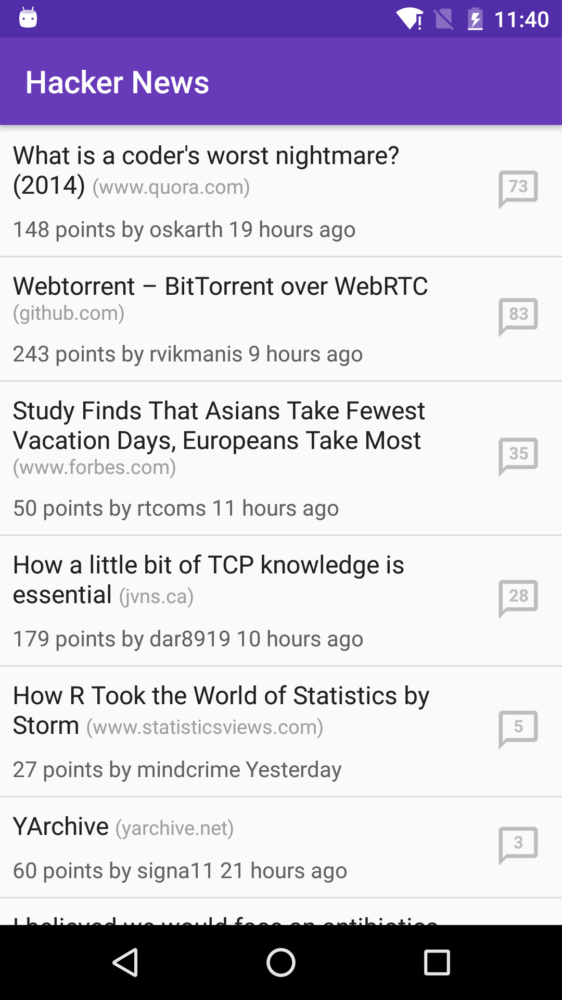

Musseta
===
[![Build Status][CI-badge]][CI-url] [![Download][dl-badge]][dl-url]

[][Google Play]

### A place to explore and learn


The app focus on architect and testing.

Currently, it simply fetches the top stories form **Hacker News** with its official API. It' s under heavily development and more features is on the way :)

It may be changed at anytime with any nice idea :punch:

### Screenshot


### Note
For some reason(especially the emulator), the [travis-ci][CI] might build failed. However, each commit has been passed locally.

### TODO
A series of articles which describe how the app architecting and testing.

### Thanks
Many thanks to the community and some of my friends who support the project. It cannot build without you, thx!

### License
```
The MIT License (MIT)

Copyright (c) 2015 longkai, HeisenbergLab

The software shall be used for good, not evil.
```

### Legal attribution
* Android, Google Play and the Google Play logo are trademarks of Google Inc.

[CI-badge]: https://travis-ci.org/longkai/Musseta.svg?branch=master
[CI-url]: https://travis-ci.org/longkai/Musseta
[dl-badge]: https://api.bintray.com/packages/longkai/dl/Musseta/images/download.svg
[dl-url]: https://bintray.com/longkai/dl/Musseta/_latestVersion
[Google Play]: https://play.google.com/store/apps/details?id=yuejia.liu.musseta&utm_source=global_co&utm_medium=prtnr&utm_content=Mar2515&utm_campaign=PartBadge&pcampaignid=MKT-Other-global-all-co-prtnr-py-PartBadge-Mar2515-1 'Get it on Google Play'
