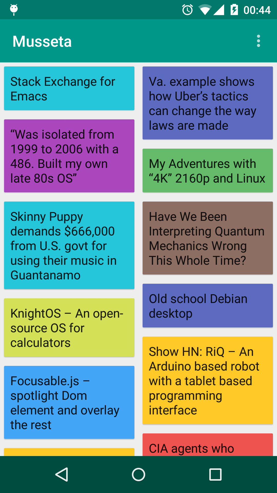

Musseta
===
### A nice way to write an Android app :smiley:
Currently, it simply fetches the top stories form **Hacker News** with its official API.

It may be changed at anytime with any nice idea :punch:

Docs will come soon :relaxed:

Thanks for starring or participating :innocent:

__NOTE: THIS IS STILL IN THE EXPERIMENT PROCESS :grey_exclamation:__



### Requirement
1. JDK 7+
2. Android Studio(1.0+)
3. Android SDK API level >= 21(Lollipop)

### How to build
1. Checkout the source code
2. Import into Android Studio
3. Run app.

Or, you could use gradle commandline, the apk will output in ``app/build/outputs/apk/``

```sh
# if you want to sign the app, use your own signing config with assembleRelease command!
# path/to/Musseta/app
$ ../gradlew clean assembleDebug
```

### License
```
The MIT License (MIT)

Copyright (c) 2014 HeisenbergLab

The software shall be used for good, not evil.
```
